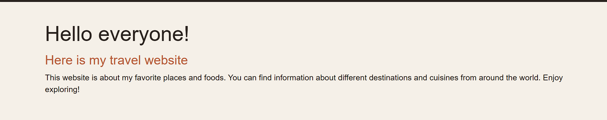
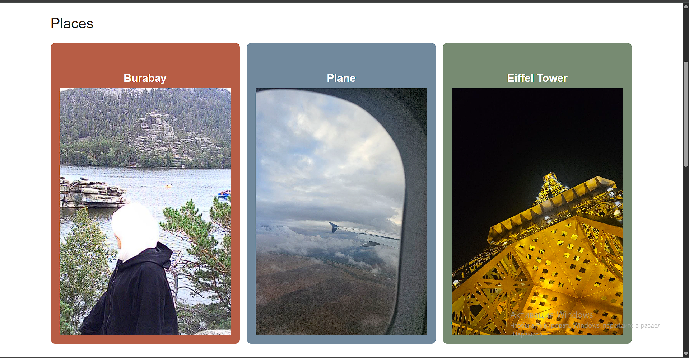

# Assignment 3 - Responsive Web Design

**Name:** Madina Sabyrgali
**Group:** IT-2503
**Course:** Web Technologies
**Assignment:** #3 - Responsive Web Design (Media Queries + Bootstrap Grid)

## Project Description

This project is a responsive travel and food website called **Travel&Taste**.

The main goal of this assignment is to practice responsive web design using:

* CSS Media Queries
* Flexbox
* Bootstrap Grid System
* Bootstrap Responsive Navbar
* Responsive typography
* Responsive layouts

The website contains information about places, food, and favorite travel destinations.

---

# Part 1. Media Queries

## Task 0. Responsive Typography

For Task 0, I created a simple introduction section with headings and a paragraph.

I used CSS Media Queries to change the font sizes depending on the screen width:

* Mobile: smaller font sizes
* Tablet: medium font sizes
* Desktop: larger font sizes

### Screenshot



---

## Task 1. Responsive Layout with Media Queries

For Task 1, I created three boxes with different travel places.

The layout changes depending on the screen size:

* **Mobile:** three boxes are stacked vertically.
* **Tablet:** two boxes are displayed in one row and the third box moves to the next row.
* **Desktop:** all three boxes are displayed in one row.

This part uses CSS Flexbox and Media Queries without Bootstrap.

### Screenshot



---

# Part 2. Bootstrap Grid System

## Task 2. Bootstrap Responsive Columns

For Task 2, I created three food columns using the Bootstrap 12-column grid system.

I used:

```html
col-12 col-md-6 col-lg-4
```

This creates:

* **Mobile:** one column per row
* **Tablet:** two columns per row
* **Desktop:** three equal columns in one row

The section contains examples of different foods.

### Screenshot

.png)

---

## Task 3. Bootstrap Navigation Bar

For Task 3, I created a responsive Bootstrap navigation bar.

The navigation contains:

* Website logo/name
* Main
* Places
* Foods
* Destinations

On smaller screens, the navigation links collapse into a hamburger menu using the Bootstrap navbar component.

### Screenshot

.png)

---

# Part 3. Combined Project

## Task 4. Responsive Travel Page

For Task 4, I combined CSS Media Queries and the Bootstrap Grid System into one responsive page.

The page contains:

### Header

A responsive Bootstrap navigation bar with the website name and navigation links.

### Main Section

The main section contains:

* Favorite travel destinations
* Information about Paris, Japan, Italy, and South Korea
* A travel profile sidebar

Bootstrap Grid is used to divide the main content into two parts:

```html
col-12 col-lg-8
```

for the main content and:

```html
col-12 col-lg-4
```

for the sidebar.

On smaller screens, the content is stacked vertically.

### Footer

The page also contains a footer at the bottom of the website.

### Screenshot

.png)

---

# Responsive Design

The project uses different breakpoints to make the website responsive.

### Mobile

The content is displayed in a single column and font sizes are smaller.

### Tablet

The layout uses two columns where required and medium font sizes.

### Desktop

The content is displayed in multiple columns and larger font sizes are used.

The main CSS breakpoints are:

```css
@media (min-width: 768px)
```

and:

```css
@media (min-width: 992px)
```

Bootstrap also uses responsive breakpoints for the grid and navigation bar.

---

# Technologies Used

* HTML5
* CSS3
* CSS Media Queries
* CSS Flexbox
* Bootstrap 5.3.3

---

# Work Process

First, I created the basic HTML structure of the website and divided it into several sections.

Then, I created the responsive typography and layout for the first tasks using CSS Media Queries.

After that, I used the Bootstrap Grid System to create responsive food columns and the navigation bar.

Finally, I combined Media Queries and Bootstrap Grid in the last section to create a responsive travel page with a main content area and sidebar.

I also tested the website at different screen sizes to make sure that the elements stack and resize correctly.

---

# Project Structure

```text
Assignment-3/
│
├── index.html
├── style.css
├── brb.png
├── plane.jpg
├── eifel.jpg
├── bauyrsaq.jpg
├── pp.jpg
├── ramen.jpg
│
├── screenshots/
│   ├── task0.png
│   ├── task1.png
│   ├── task2.png
│   ├── task3.png
│   └── task4.png
│
└── README.md
```

---

# Conclusion

This assignment helped me understand how responsive web pages work.

I practiced creating layouts for mobile, tablet, and desktop screens using CSS Media Queries and the Bootstrap 12-column Grid System. I also learned how to create a responsive navigation bar and combine Bootstrap with custom CSS.

The final result is a responsive **Travel&Taste** website about travel destinations and food.
